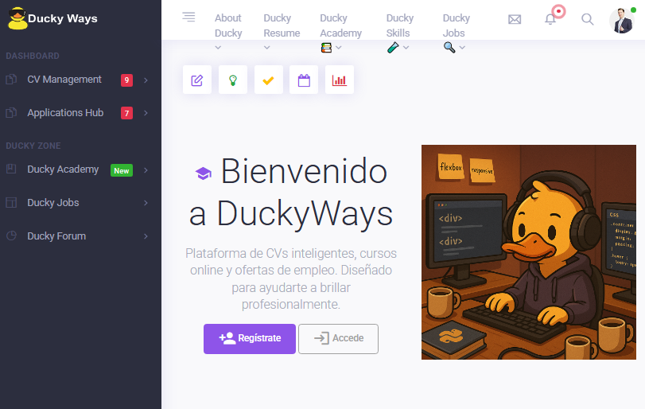

# 🦆 Ducky — Curriculum Web (rama `cv`)


---

## 🧾 Descripción

**Ducky** es una aplicación web desarrollada con **Django** orientada a la gestión y presentación de un **currículum vitae (CV) dinámico y personalizable**.  
Permite administrar información profesional, publicaciones de blog, experiencias laborales, proyectos, medios y más, desde un panel de control amigable.

La rama `cv` representa la versión enfocada en el **currículum personal**, integrando módulos de usuario, trabajos, medios y contenido dinámico.

---

## 🧩 Características principales

- 👤 Gestión de usuarios (registro, login, perfiles).
- 🧰 Módulo de trabajos y proyectos.
- 📰 Sección de blog personal.
- 🖼️ Gestión de imágenes y archivos multimedia.
- ⚙️ Panel de administración (Django Admin).
- 🎨 Plantillas HTML personalizables con CSS y JS.
- 💾 Base de datos SQLite por defecto (fácil despliegue).

---

## 🚀 Tecnologías utilizadas

| Tecnología | Descripción |
|-------------|-------------|
| **Python 3.9+** | Lenguaje principal |
| **Django** | Framework web backend |
| **HTML / CSS / JS** | Frontend y plantillas |
| **SQLite** | Base de datos local |
| **Bootstrap (opcional)** | Estilos responsivos |
| **Pillow, Django REST Framework** | Manejo de imágenes y API (si está habilitado) |

---

## ⚙️ Instalación y configuración

### 1️⃣ Clona el repositorio

```bash
git clone https://github.com/mihifidem/ducky.git
cd ducky
git checkout cv
```

### 2️⃣ Crea un entorno virtual (opcional pero recomendado)

```bash
python -m venv venv
```
# En Windows
```
venv\Scripts\activate
```
# En macOS/Linux
source venv/bin/activate

### 3️⃣ Instala las dependencias
```bash

pip install -r requirements.txt
```
### 4️⃣ Aplica las migraciones
```bash

python manage.py migrate
```
### 5️⃣ Inicia el servidor
```bash
python manage.py runserver
Luego visita 👉 http://127.0.0.1:8000/ para ver la aplicación.
```
### 🧠 Estructura del proyecto
- Este repositorio contiene un proyecto Django con módulos para gestión de usuarios, CVs, blog y trabajos/proyectos.
```
ducky/
├── account/ 🧑‍💻 Gestión de usuarios y autenticación
│ └── cv_manager/ 📄 Gestión de CVs
├── blog/ 📝 Entradas de blog y artículos
├── core/ ⚙️ Configuración y utilidades base
├── jobs/ 💼 Módulo de trabajos / proyectos
├── media/ 🖼️ Archivos multimedia subidos
├── static/ 💾 Archivos estáticos (CSS, JS, imágenes)
├── templates/ 🏗️ Plantillas HTML del sitio
├── utils/ 🔧 Funciones auxiliares y helpers
├── manage.py 🏃 Script principal de Django
├── db.sqlite3 🗄️ Base de datos por defecto
├── requirements.txt 📦 Dependencias del proyecto
└── README.md 📖 Explicación del proyecto y pasos a seguir
```
### 💻 Uso
- Inicia sesión o crea un nuevo usuario.

- Accede al panel de administración (/admin/) para gestionar el contenido.

- Modifica las plantillas HTML en la carpeta templates/ para personalizar el estilo y diseño de tu CV.

- Los archivos multimedia se almacenan en la carpeta media/.

### 🧪 Tests
- Si el proyecto incluye pruebas automáticas, puedes ejecutarlas con:

```bash
python manage.py test
```
### 🧰 Variables de entorno
- Puedes crear un archivo .env en la raíz del proyecto con configuraciones como:
```bash
DEBUG=True
SECRET_KEY=tu_clave_secreta
ALLOWED_HOSTS=127.0.0.1,localhost
```
- Asegúrate de no subir el archivo .env al repositorio.
- Inclúyelo en .gitignore.

### 📸 Capturas de ejemplo (opcional)
- Agrega imágenes en la carpeta /media o en /docs y enlázalas aquí:

```

```

### 📄 Licencia
- Este proyecto está licenciado bajo la MIT License.
- Consulta el archivo LICENSE para más información.

### 👤 Autor
- mihifidem

### 📍 GitHub
- 📧 (https://github.com/mihifidem/ducky/tree/cv)