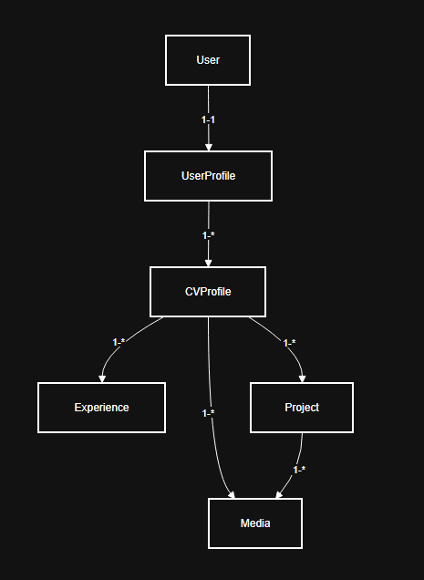

# Documentación de Arquitectura — Ducky (rama `cv`)

> Fecha: 2025-10-14

## 🎯 Objetivo

Proveer una guía clara y compacta para entender la **estructura del proyecto**: aplicaciones (apps), modelos principales y sus relaciones, rutas clave y aspectos de configuración relevantes. Este documento está pensado para desarrolladores que vayan a mantener, desplegar o ampliar el proyecto.

---

## 📁 Ubicación

`docs/arquitectura.md`.

---

## 🧱 Apps principales

En la rama `cv` las aplicaciones relevantes son:

- **account**
  - Gestión de usuarios: registro, login, perfiles, permisos y roles.
  - Relaciones con `UserProfile` y otras entidades relacionadas al usuario.

- **cv_manager**
  - Gestión de CVs, experiencias, proyectos y secciones de perfil.
  - Endpoints y vistas para mostrar/editar CVs por `slug`.

> Nota: Ajusta los nombres si en tu proyecto son distintos (`jobs`, `core`, `blog`).

---

## 📦 Modelos principales y relaciones

### Modelos

- **User** (Django `auth.User` o CustomUser)  
  Campos típicos: `username`, `email`, `is_active`, `is_staff`.

- **UserProfile**  
  - FK one-to-one con `User` (`user = OneToOneField(User, on_delete=CASCADE)`)  
  - Campos: `full_name`, `bio`, `location`, `photo`, `social_links`

- **CVProfile**  
  - FK a `UserProfile` (`owner = ForeignKey(UserProfile, related_name='cvs', on_delete=CASCADE)`)  
  - Campos: `title`, `slug`, `summary`, `visibility`, `created_at`, `updated_at`

- **Experience**  
  - FK a `CVProfile` (`cv = ForeignKey(CVProfile, related_name='experiences', on_delete=CASCADE)`)  
  - Campos: `company`, `role`, `start_date`, `end_date`, `description`

- **Project**  
  - FK a `CVProfile`  
  - Campos: `title`, `description`, `url`, `technologies`

- **Media**  
  - FK o relación genérica a `CVProfile` / `UserProfile` / `Project`  
  - Campos: `file`, `alt_text`, `uploaded_at`

### Relaciones clave

- `User` 1 — 1 `UserProfile`  
- `UserProfile` 1 — * `CVProfile`  
- `CVProfile` 1 — * `Experience`  
- `CVProfile` 1 — * `Project`  
- `CVProfile` 1 — * `Media`  
- `Project` 1 — * `Media` (opcional)

---

## 🌐 Rutas clave

### Autenticación (`account`)

- `/account/login/` — Login  
- `/account/logout/` — Logout  
- `/account/register/` — Registro  
- `/account/profile/` — Perfil del usuario

### CVs (`cv_manager`)

- `/cv/` — Listado o dashboard de CVs  
- `/cv/create/` — Crear nuevo CV  
- `/cv/<slug>/` — Vista pública del CV  
- `/cv/<slug>/edit/` — Editar CV (propietario o admin)

### API (si existe DRF)

- `/api/v1/cvs/` — Listar / crear CVs  
- `/api/v1/cvs/<id>/` — Detalle / actualizar / borrar CVs

### Admin

- `/admin/` — Panel de administración Django

---

## ⚙️ Configuración relevante

- **settings.py / settings/**  
  - `INSTALLED_APPS`: incluir `account`, `cv_manager`, otras apps  
  - `AUTH_USER_MODEL`: si usas modelo de usuario personalizado  
  - `MEDIA_ROOT` / `MEDIA_URL`  
  - `STATIC_ROOT` / `STATIC_URL`  
  - `DATABASES` (por defecto SQLite)

- **.env** (recomendado)  
  - `DEBUG`, `SECRET_KEY`, `ALLOWED_HOSTS`  
  - Variables para servicios externos (S3, SendGrid, Keys)

- **requirements.txt**  
  Listado de dependencias:

  - asgiref==3.9.0
  - Django==5.2.4
  - pillow==11.3.0
  - python-decouple==3.8
  - wheel==0.45.1
  - crispy-bootstrap5==2025.6
  - django-crispy-forms==2.4
  - setuptools==78.1.1
  - sqlparse==0.5.3
  - tzdata==2025.2

---

## 🗺 Diagrama de relaciones

*Diagrama de relaciones del proyecto*

---

## ✅ Checklist de entrega

- [ ] Crear carpeta `docs/`  
- [ ] Añadir `docs/arquitectura.md`  
- [ ] Ajustar nombres de clases y campos a los reales del proyecto  
- [ ] Colocar imagen del diagrama en `docs/diagramas/`  
- [ ] Referenciar este documento desde `README.md`  

---

## 📌 Notas

- Mantener actualizado con cambios en modelos, rutas o configuración.  
- Para API pública, considera añadir contrato de endpoints (OpenAPI/Swagger).  
- Para diagramas más detallados: clases, secuencias, flujos de login, etc.
